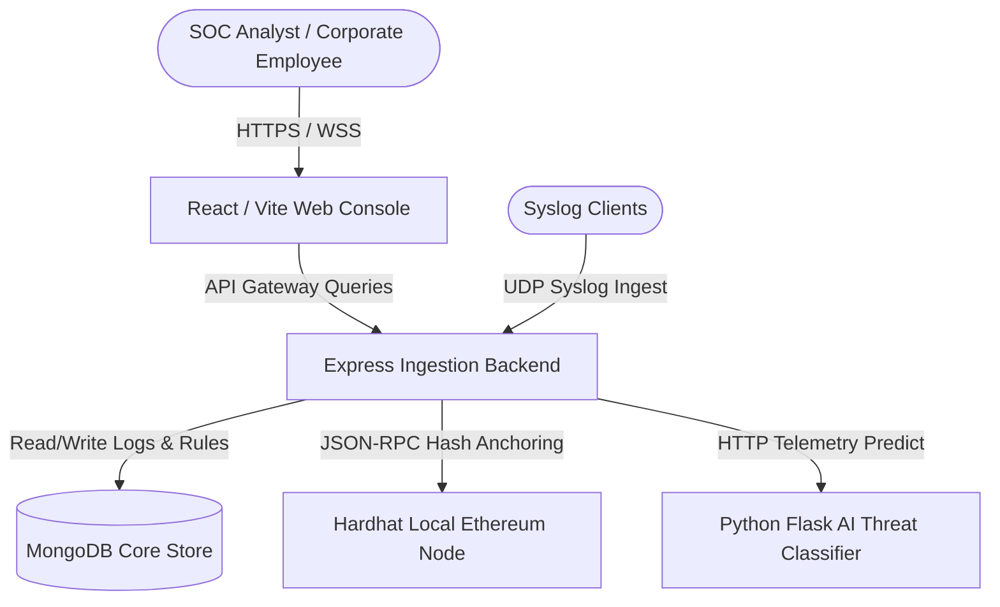

# SentinelX: AI-Blockchain Hybrid SIEM & SOAR Cybersecurity Platform

SentinelX is a state-of-the-art hybrid Security Information and Event Management (SIEM) and Security Orchestration, Automation, and Response (SOAR) command center. It combines Machine Learning (ML) threat heuristics with Ethereum Blockchain log anchoring to create a highly visual, completely tamper-proof log auditing and threat response platform.

---

## 1. Project Architecture Overview

The system is built on a decoupled, high-performance microservices architecture:



### Component Breakdown
1. **Frontend (React / Vite)**: A premium dark-themed dashboard styled with CSS custom systems. Provides real-time threat charts, alerts, UBA risk scoring, detection rule editors, and ledger auditing tools.
2. **Backend (Node.js / Express)**: High-throughput ingestion server that coordinates WebSocket log streaming, validates JSON Web Tokens (JWT), processes RBAC routing, manages active API keys, runs automated SOAR workers, and bridges data to the AI Engine and local Blockchain.
3. **AI Engine (Python / Flask)**: Runs a trained machine learning classifier model (Scikit-Learn Random Forest/SVM heuristics) to grade event threat risks dynamically from 0% to 100%.
4. **Blockchain Anchor (Ethereum / Solidity)**: A Solidity smart contract (`LogIntegrity.sol`) compiled and hosted on a Hardhat local node. Anchors batches of log hashes to the ledger to enforce audit-trail immutability.
5. **Database (MongoDB)**: Stores structured log documents, system configuration rules, threat warning profiles, user accounts, and anchored blockchain records.

---

## 2. Why Each Component is Critical

| Component | Technology | Why We Need It |
| :--- | :--- | :--- |
| **Tamper-Proof Audit** | `Solidity & Ethereum` | Attackers always attempt to clear/alter security log files to hide their presence. Blockchain makes logs mathematically immutable. Auditing compares the database against block headers to flag any tamper attempt instantly. |
| **Predictive Scoring** | `Python Heuristic Engine` | Standard SIEM systems rely on static threshold rules. The AI Classifier detects complex anomaly combinations (e.g. geographical shifting + rapid file access) to assign a dynamic probability score. |
| **Real-Time Visualizer** | `React & Tailwind` | Security Operations Centers (SOC) need to prioritize threats instantly. The interactive charts, line trends, and alerts console compile millions of records into prioritized visual categories. |
| **Log Collector** | `Node.js & Socket.io` | Captures incoming telemetry via UDP Syslog or REST API endpoints, pushes them instantly to the client browser, and automatically executes SOAR scripts without slowing down database writes. |
| **Persistent Storage** | `MongoDB Document Store` | Logs vary drastically in format (SSH logins vs SQL queries). MongoDB allows us to store polymorphic event data with flexible schemas at scale. |

---

## 3. Database Schema Configuration (MongoDB Collections)

The database utilizes the following collections under the `sentinelx` database:

* **`users`**: Stores seeded system credentials:
  * **5 SOC Analysts** (`analyst1@sentinelx.io` to `analyst5@sentinelx.io`, password: `Analyst@123456`)
  * **10 Employees** (`employee1@sentinelx.io` to `employee10@sentinelx.io`, password: `Employee@123456`)
  * *Note: Passwords are encrypted using secure `bcrypt` hashes.*
* **`auditlogs`**: Stores all administrative user action trails (`LOGIN_SUCCESS`, `RESET_PASSWORD`, `CREATE_RULE`, etc.). These are the logs that get anchored to the blockchain.
* **`blockchainrecords`**: Keeps track of anchored batches, block numbers, transaction hashes, and the list of audit log IDs locked inside each block.
* **`events`**: Telemetry log records (SQL Injection, Brute Force, Scanning) with source/destination IPs, byte counts, and threat indicators.
* **`alerts`**: High-severity threat alerts derived from rules or ML thresholds awaiting SOC analyst review.
* **`rules`**: Stores user-configured SIEM correlation rules.
* **`playbooks`**: Stores SOAR automated responses (e.g., block IP, isolate host).

---

## 4. Key Functional Features Completed

1. **Multi-Role Login Portal**:
   * Complete removal of MFA for simplified flow.
   * Dynamic Quick-Fill credential panels allowing direct role selection for the 5 SOC Analysts and 10 Employees (the default admin account has been completely removed).
2. **Global Search Engine**:
   * Live search inputs in the top navbar filter dashboard events by IP, Protocol, or Threat category dynamically.
3. **Account Settings Password Reset**:
   * Logged-in analysts can change their credentials securely in the settings panel. This hashes the new password with BCrypt in MongoDB and logs a `PASSWORD_RESET` audit log event.
4. **Real-time Ingestion & Health Checks**:
   * Background simulators generate telemetry, while the system monitor widget displays green online statuses for MongoDB, Blockchain RPC, the AI Engine, and the Syslog Pipe.
5. **Automatic Blockchain Ledger Verification**:
   * The backend dynamically verifies all anchored records on load or poll.
   * If a log is edited in MongoDB Compass, the verification check fails. A flashing red warning banner (`🚨 Security Alteration Detected`) immediately appears on **both the main Dashboard and the Ledger Auditing console**.
   * A critical system alert (`ALT-TAMPER`) is injected directly into the Live Threat Warnings feed on the dashboard sidebar.

---

## 5. How to Run the Project (Developer Commands)

Run each command in a separate terminal window from the root of the project directory:

### Step 1: Start the Local Blockchain Node
```bash
cd blockchain
npm install
npx hardhat node
```

### Step 2: Deploy the Smart Contract
Ensure the contract is deployed to the active network:
```bash
cd blockchain
npx hardhat run scripts/deploy.js --network localhost
```
*Note: Copy the contract address printed in console and paste it into `backend/.env` under the `CONTRACT_ADDRESS` variable.*

### Step 3: Run the database seed (First time setup)
This populates the database with the 10 Employees, 5 SOC Analysts, and initial config settings:
```bash
cd backend
npm run seed
```

### Step 4: Start the Ingestion Backend
```bash
cd backend
npm install
npm start
```

### Step 5: Start the Python AI Engine
Ensure Python 3 is installed:
```bash
cd ai-module
pip install -r requirements.txt
python src/app.py
```

### Step 6: Start the Frontend Console
```bash
cd frontend/ai-blockchain-frontend
npm install
npm run dev
```
Open [http://localhost:5173/](http://localhost:5173/) in your web browser.
